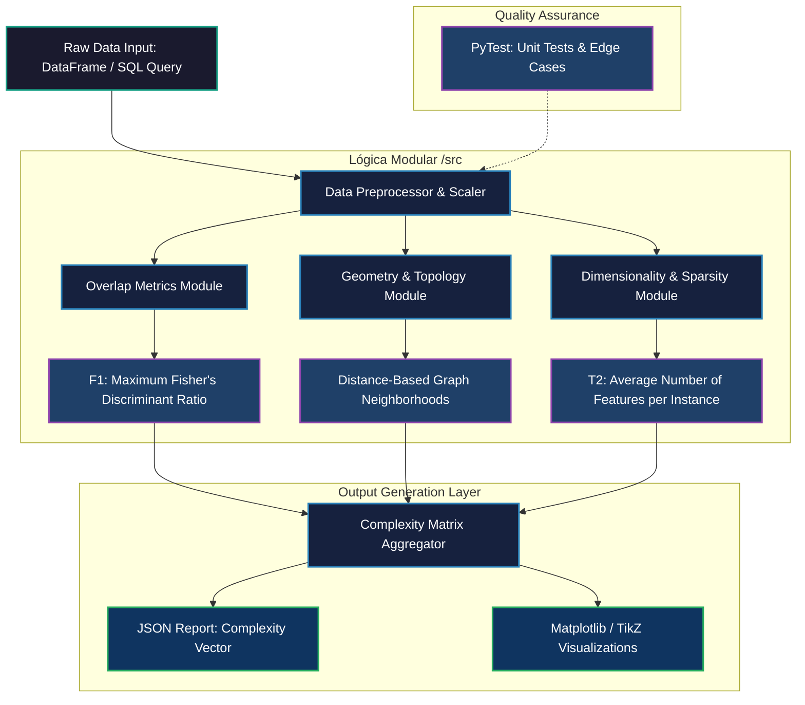

# Data Complexity Engine

A modular Python library designed to evaluate classification dataset complexity within MLOps/DataOps pipelines using strict separation of concerns.

## Pipeline Architecture




## Analytical Design

### 1. Overlap Module
Computes Maximum Fisher's Discriminant Ratio ($F1$):

$$F1 = \frac{(\mu_1 - \mu_2)^2}{\sigma_1^2 + \sigma_2^2}$$

Low scores signal severe class overlapping.

### 2. Geometry Module
Computes Neighborhood Frontier Ratio ($N1$ proxy) using Euclidean metrics:

$$N1 = \frac{1}{N} \sum_{i=1}^{N} \mathbb{I}\left( y_i \neq y_{\text{NN}(i)} \right)$$

Values near $1.0$ indicate high topological boundary complexity.

## Architecture

```text
data-complexity-metrics/
├── pyproject.toml
├── src/data_complexity/
│   ├── preprocessing.py
│   ├── reports.py (JSON output)
│   └── metrics/ (overlap.py, geometry.py)
└── tests/ (pytest automated validation)
```
## Verification
```
pip install -e .
pytest -v tests/
python src/data_complexity/main.py
```
